<div align="center">

# docsify-charty

<small style="margin-bottom:2em;">by Mark Battistella</small>

[](https://www.paypal.me/markbattistella/6AUD)
[](https://www.buymeacoffee.com/markbattistella)
</div>

---

## Installation

### Update `index.html` file

1. Add the following script and stylesheet to your `index.html` via either CDN or downloading it and using it locally:

    **unpkg.com**
    ```html
    <script src="//unpkg.com/@markbattistella/docsify-charty@latest/dist/docsify-charty.min.js"></script>
    <link rel="stylesheet" href="//unpkg.com/@markbattistella/docsify-charty@latest/dist/docsify-charty.min.css">
	```

	**jsDelivr.com**
	```html
    <script src="//cdn.jsdelivr.net/npm/@markbattistella/docsify-charty@latest"></script>
    <link rel="stylesheet" href="//cdn.jsdelivr.net/npm/@markbattistella/docsify-charty@latest/dist/docsify-charty.min.css">
	```

    **locally**
	```html
    <script src="docsify-charty.min.js"></script>
    <link rel="stylesheet" href="docsify-charty.min.css">
    ```

1. In docsify setup configure the plugin (see [configuration](#configuration) for setup). These are the global settings and affect all charts:

    ```js
    window.$docsify = {
      charty: {
        "theme": String,
        "mode":  String,
		"debug": Boolean
      }
    };
    ```

### npm install

Or if you're using `npm` to manage your dependencies:

```sh
npm i @markbattistella/docsify-charty
```

## Configuration

### Global settings

| Name    | Accepts   | Description                                        |
|---------|-----------|----------------------------------------------------|
| `theme` | `String`  | Set a global theme for chart colours - must be HEX |
| `mode`  | `String`  | Dark or light theme - to compliment your design    |
| `debug` | `Boolean` | Shop warning or error messages in the console      |

### Per chart settings

| Name              | Accepts       | Description                              |
|-------------------|---------------|------------------------------------------|
| `title`           | `String`      | The title of the chart, displayed at the top. Leave blank if you want to hide it |
| `caption`         | `String`      | The sub-text of the chart, displayed under the title. Leave blank to hide it |
| `type`            | `String`      | The type of charty you want to display   |
| `options.theme`   | `String`      | Set an individual theme to this chart. It will override the global theme |
| `options.legend`  | `Boolean`     | Show the legend. Default `true`          |
| `options.labels`  | `Boolean`     | Show the chart labels. Default `true`    |
| `options.numbers` | `Boolean`     | Show the chart numbers. Default `true`   |
| `data.label`      | `String`      | Graphed data point label                 |
| `data.value`      | `Int / Array` | Graphed value that puts it on the render |
| `data.colour`     | `String`      | Override the global and theme with a specific colour |

### Markdown code

```json
{
  "title":   '',
  "caption": '',
  "type":    '',
  "options": {
    "theme":   '',
	"legend":  '',
    "labels":  '',
    "numbers": ''
  },
  "data": [
    {
	  "label": '',
	  "value": '',
	  "colour": ''
    }
  ]
}
```

## Types of charts

### Circular

#### pie

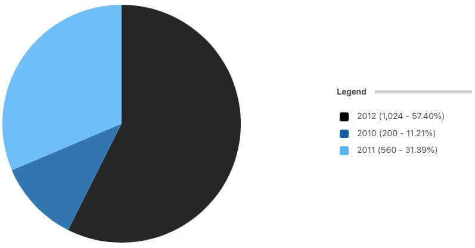

#### donut / doughnut

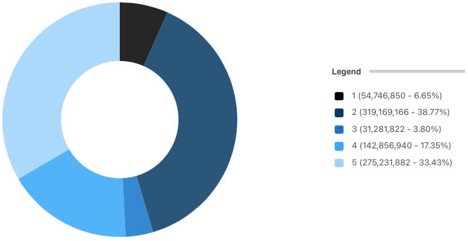

#### section / sectional

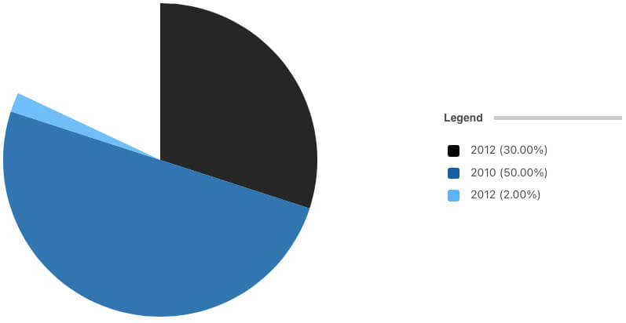

#### rings

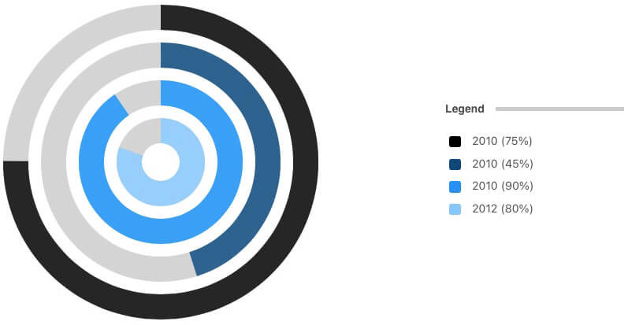

### Area

#### radar

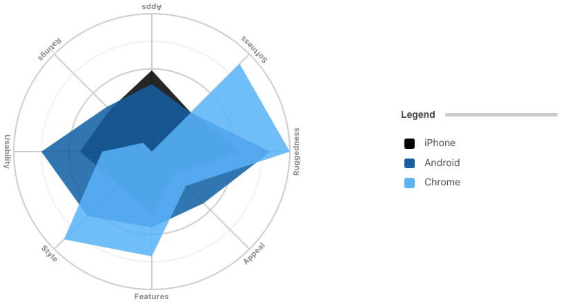

#### area

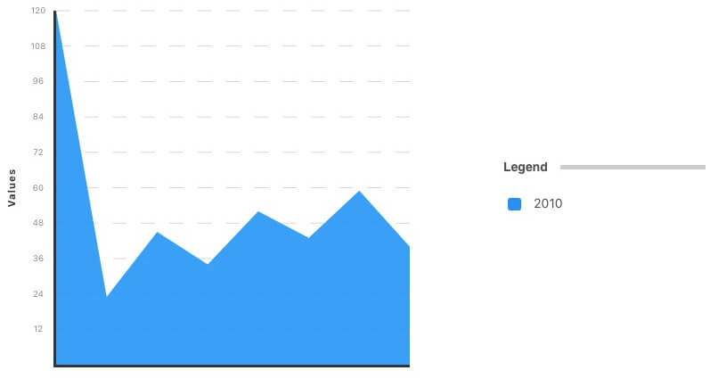

### Plot

#### scatter


#### bubble

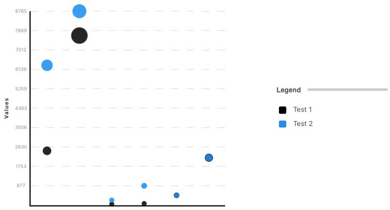

#### line

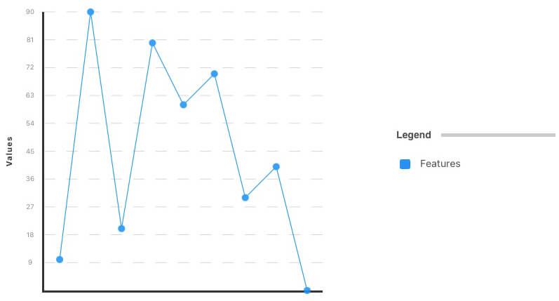<br>
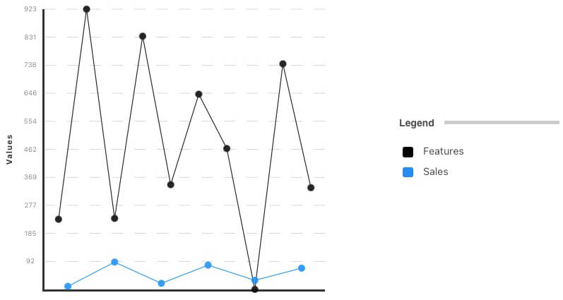

### Bar / Column

### bar / bar-stack

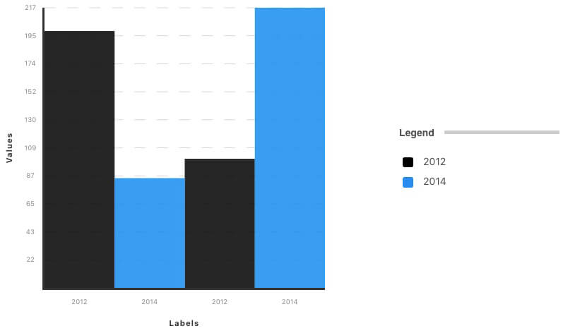<br>
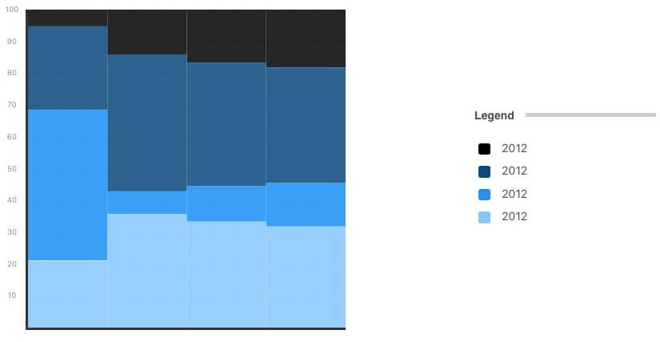

### column / column-stack

<br>
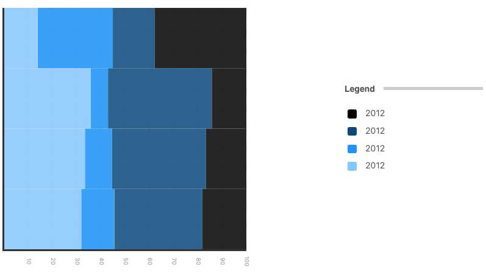

### Rating

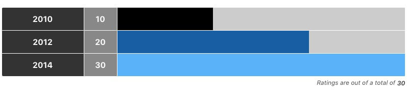

## Contributing

1. Clone the repo:

    `git clone https://github.com/markbattistella/docsify-charty.git`

1. Create your feature branch:

    `git checkout -b my-feature`

1. Commit your changes:

    `git commit -am 'Add some feature'`

1. `Push` to the branch:

    `git push origin my-new-feature`

1. Submit the `pull` request
