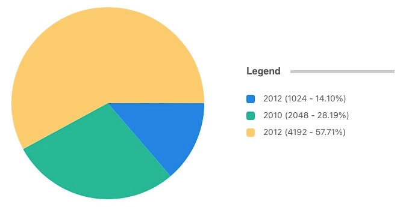
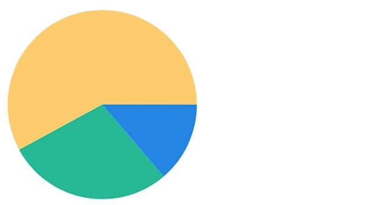
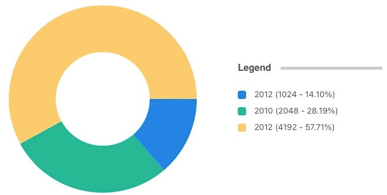
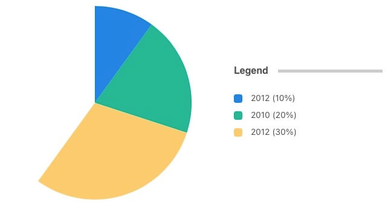
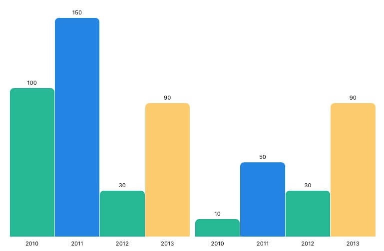
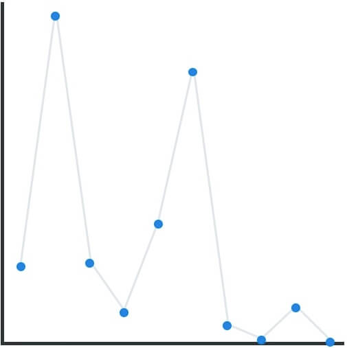
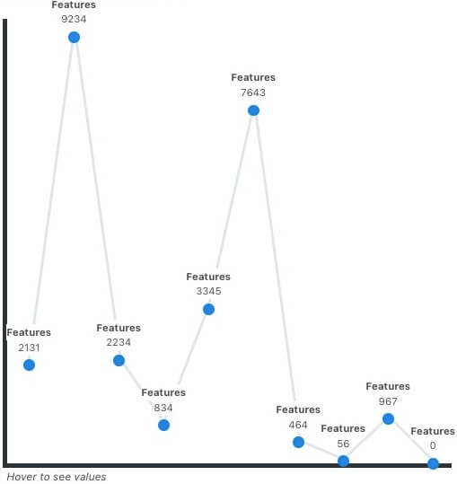
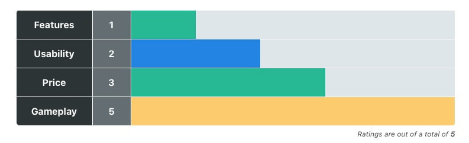

<div align="center">

# docsify-charty

[](https://www.paypal.me/markbattistella/6AUD)
[](https://www.buymeacoffee.com/markbattistella)
</div>

---

> I wanted to create something that was powerful but also not too overbearing.<br><br>There are tonnes of charing libraries out there, and some are **way** more powerful but I wanted to try building my own.<br><br>My main goal was to have a format that was reusable, and easy to switch between a pie chart to a rating block to a bar graph - all without changing the main data.<br><br>There's some work still to be done, but I think at the moment it is functional enough for small use.

## Installation

### Update `index.html` file

Assuming you have a working [docsify](https://docsify.js.org/) framework set up, it is easy to use the plugin.

1. Add the following script tag to your `index.html` via either CDN or downloading it and using it locally:

    ```html
    <!-- unpkg.com -->
    <script src="https://unpkg.com/@markbattistella/docsify-charty@latest"></script>

    <!-- jsDelivr -->
    <script src="https://cdn.jsdelivr.net/npm/@markbattistella/docsify-charty@latest"></script>

    <!-- locally -->
    <script src="docsify-charty.min.js"></script>
    ```

1. In docsify setup configure the plugin (see [configuration](#configuration) for setup):

    ```js
    <script>
    window.$docsify = {
      charty: {
      },
    };
    </script>
    ```

### npm install

Or if you're using `npm` to manage your dependencies:

```sh
npm i @markbattistella/docsify-charty
```

### Configuration

## Types of charts

### Pie Chart

#### With legend



#### Without Legend



### Donut / Doughnut Chart



### Sectional chart



### Column chart



### Line graph

### Normal state



### Hover for details



### Plot graph


### Review / rating chart



## Contributing

1. Clone the repo:

    `git clone https://github.com/markbattistella/docsify-charty.git`

1. Create your feature branch:

    `git checkout -b my-feature`

1. Commit your changes:

    `git commit -am 'Add some feature'`

1. `Push` to the branch:

    `git push origin my-new-feature`

1. Submit the `pull` request
